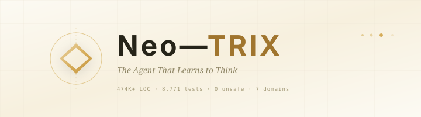

<p align="center">
  
</p>

<p align="center">
  <em>The agent that learns to think</em><br>
  <code>neo-trixs.github.io</code> — the NeoTrix homepage
</p>

---

## What this is

This is the GitHub Pages site for **NeoTrix** — an open-source AI-native developer toolkit with self-evolving reasoning.

- **`index.html`** — the Liquid Glass galaxy homepage (interactive E8 visualization, glassmorphism panels, live telemetry)
- **`/guide/*`** — VitePress documentation (getting started, CLI reference, architecture)
- **`/api/*`** — API and integration documentation
- **`product-landing-index.html`** — archived single-page narrative landing (kept as reference)

## Local development

The site is built from `docs/` in the [NeoTrix](https://github.com/neo-trixs/NeoTrix) repository with VitePress.

```sh
cd docs
npm install
npm run dev      # live preview at localhost:5173
npm run build    # output → docs/.vitepress/dist
```

The built output is committed to this repo's `main` branch and served by GitHub Pages.

## Structure

| Path | Content |
|------|---------|
| `/` | Liquid Glass galaxy homepage |
| `/guide/getting-started` | Install & first session |
| `/guide/cli` | CLI command reference |
| `/guide/rules-system` | Architecture rules (R-P1 …) |
| `/guide/user` | User manual |
| `/api/overview` | API overview |
| `/api/events` | Event bus reference |
| `/api/mcp-2026-ecosystem` | MCP ecosystem notes |

## Links

- [NeoTrix repository](https://github.com/neo-trixs/NeoTrix)
- [NeoTrix profile](https://github.com/neo-trixs)
- [NeoTrix releases](https://github.com/neo-trixs/NeoTrix/releases)
